# Beledci.az — Customer Experience Intelligence Report

- **Platform:** [beledci.az](https://beledci.az) — Azerbaijan's leading consumer review portal
- **Scope:** 139 companies · 16 industry sectors · 2,856 customer reviews
- **Purpose:** This report translates raw customer feedback into actionable business intelligence for executives, brand owners, and market participants.

---

## Executive Summary

Customer sentiment across Azerbaijan's consumer market is critically polarised. **86.6% of all reviews are 1-star**, pointing to a systemic gap between service delivery expectations and actual experience. The most-reviewed sectors — Internet Providers, Taxi, Mobile Operators, and Banks — are simultaneously the most complained-about. No sector achieves an average rating above 2.1 out of 5.0. This is not a company-level problem; it is a market-wide trust deficit requiring sector-by-sector strategic response.

---

## Finding 1 — The Platform is Dominated by Complaints

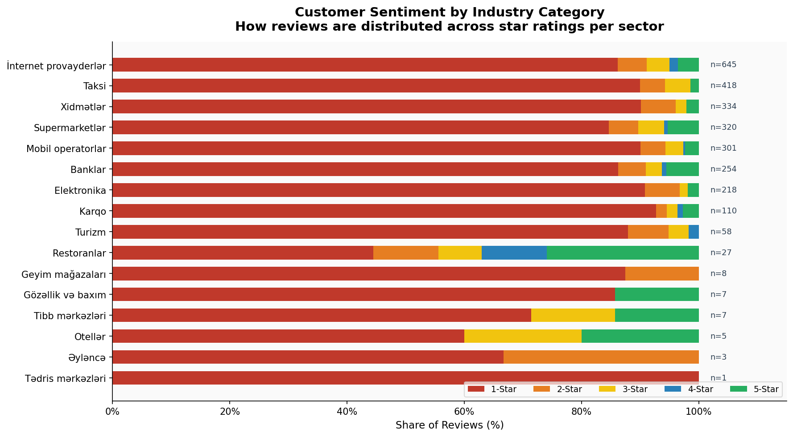

Across all 2,856 reviews collected, only **13.4% carry a rating of 2 stars or above**. The overwhelming majority of customers who leave feedback do so because something went wrong. Restaurants and Hotels show relatively better sentiment diversity, but they also receive far fewer reviews — meaning their reputations are less battle-tested.

**What this means:** Review platforms in Azerbaijan function primarily as complaint channels, not balanced rating systems. Brands that accumulate many reviews are accumulating complaints, not endorsements. Any brand with a high review count must treat that as a risk signal first.

---

## Finding 2 — Internet Providers Generate the Highest Complaint Volume

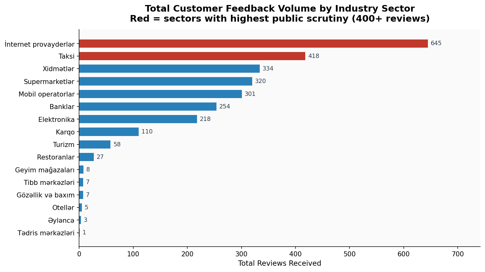

Internet Providers top the leaderboard with **645 total reviews**, followed by Taxi (418), Mobile Operators (301), and Supermarkets (320). These four sectors alone account for **62% of all platform feedback**.

**What this means:** These industries face the highest levels of public scrutiny. Brands operating in these spaces have the most to gain from proactive reputation management — and the most to lose from ignoring it. Regulatory bodies and consumer advocates should monitor these sectors closely, as the volume of dissatisfaction suggests structural service delivery failures.

---

## Finding 3 — Six Brands are in Critical Reputation Crisis

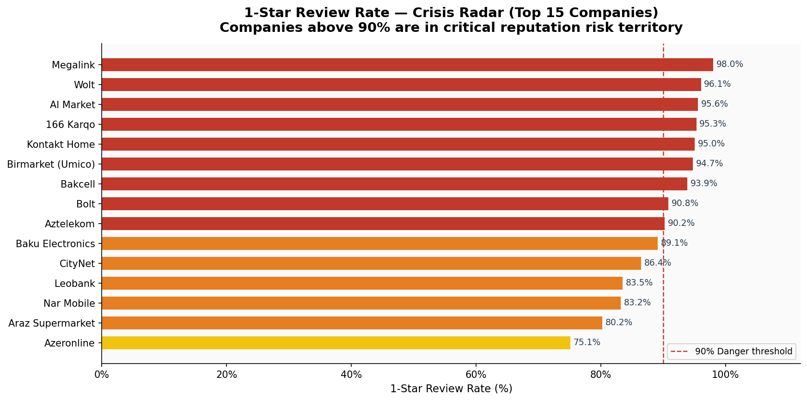

Among the 15 most-reviewed companies, six exceed the **90% 1-star threshold**:

| Company | 1-Star Rate | Total Reviews |
|---|---|---|
| Megalink | 98.0% | 101 |
| Wolt | 96.1% | 76 |
| Kontakt Home | 95.0% | 121 |
| Al Market | 95.6% | 90 |
| 166 Karqo | 95.3% | 64 |
| Birmarket (Umico) | 94.7% | 95 |

These brands are not receiving occasional bad reviews — they are receiving almost exclusively bad reviews from a substantial customer base. This indicates structural service failures, not isolated incidents.

**What this means:** For these companies, a reactive customer service approach is insufficient. The complaint pattern signals the need for operational transformation: reviewing delivery processes, staff training, complaint resolution mechanisms, and possibly pricing or product-market fit.

---

## Finding 4 — The Most Reviewed Companies Set the Market Narrative

**Bolt (338 reviews)** leads all companies in feedback volume — nearly 45% more than the second-place Azeronline (237). Other high-visibility brands include Bakcell, Leobank, Kontakt Home, and Nar Mobile.

These companies, by virtue of their scale, shape public perception of their entire sector. A negative reputation for Bolt affects how consumers perceive the taxi industry broadly; the same applies to Bakcell for mobile networks.

**What this means:** High-volume brands carry disproportionate responsibility for category-level trust. Improvement at the top brands creates a halo effect across the sector. Conversely, sustained poor performance at the top erodes trust even for competitors who serve customers well.

---

## Finding 5 — No Sector Fully Escapes Reputation Risk

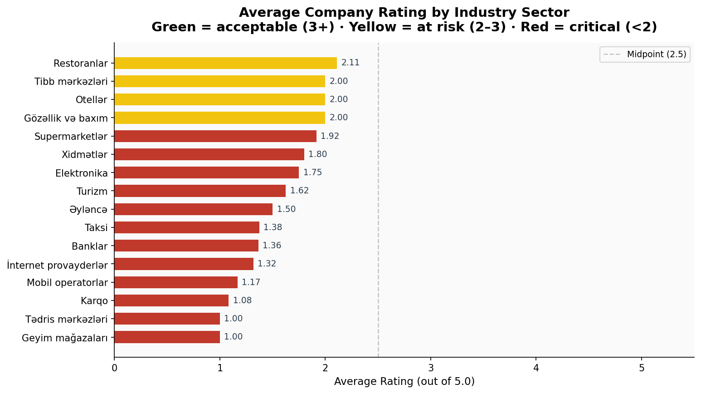

The best-performing sector by average rating is **Beauty & Care (2.0)**, followed by **Clinics (1.5)** and **Supermarkets (1.77)**. No sector reaches the neutral midpoint of 2.5 out of 5.0.

Restaurants show the highest rating variability — some restaurants perform reasonably well, while others drag the average down. This is characteristic of a fragmented market where individual operators significantly differ in quality.

**What this means:** There is no "safe" sector from a reputation standpoint. Even sectors with lower review volumes (Hotels, Restaurants) risk rapid reputation deterioration if a single high-profile brand begins attracting negative attention. Every sector should treat current silence as opportunity, not as approval.

---

## Finding 6 — 80 Companies are "Low" Rated; 44 Have No Rating at All

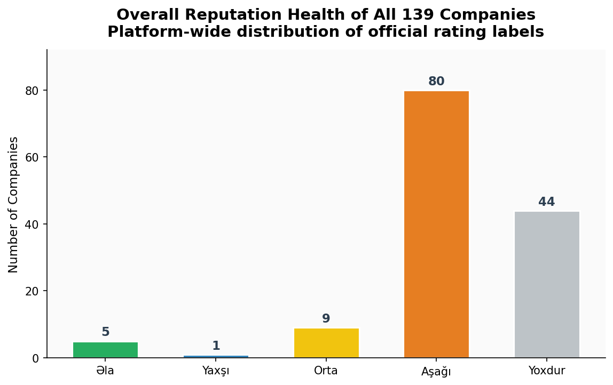

Of 139 companies on the platform:
- **80 (57.6%)** carry the "Aşağı" (Low) official rating
- **44 (31.7%)** have zero reviews and no rating — effectively invisible to consumers
- Only **6 companies (4.3%)** have achieved an "Excellent" rating

The 44 unrated companies represent both an opportunity and a risk. They are currently unchallenged in the court of public opinion, but their first negative reviews will define their reputation with no positive baseline to absorb the impact.

**What this means:** Brands with no reviews should proactively encourage satisfied customers to leave feedback before dissatisfied customers define the narrative. The first few reviews on a company page carry outsized influence on perceived reputation.

---

## Finding 7 — Large Sectors Have a Significant Engagement Gap

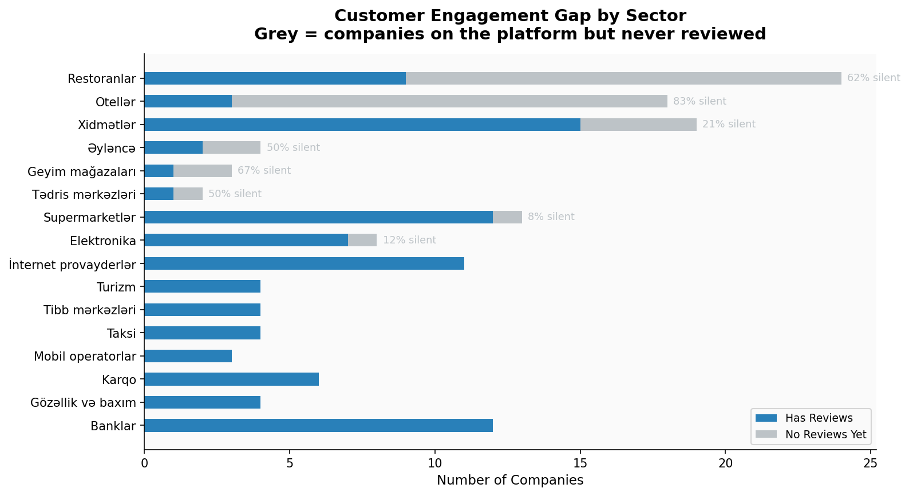

The Restaurants sector has **62.5% of its companies completely unreviewed**, despite being the largest sector by number of brands (24 companies). Hotels are even more stark: **83% of the 18 hotel brands have received zero reviews**.

This creates a distorted picture: a handful of frequently reviewed brands set the tone for an entire sector, while the majority operate in public-feedback silence.

**What this means:** Hotel and Restaurant brands that are currently silent on review platforms are exposed. As digital-savvy consumers grow, the absence of a review profile is itself a negative signal. Hotels in particular — as high-consideration, high-spend purchase decisions — should treat customer feedback as a core component of their marketing strategy.

---

## Finding 8 — The Sector Risk Matrix Reveals Where Action is Most Urgent

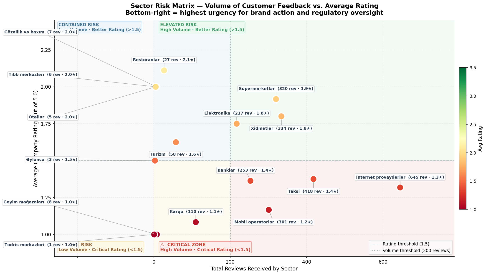

Plotting review volume against average rating reveals four distinct strategic positions:

- **Bottom-right (High Volume, Low Rating) — CRITICAL RISK:** Internet Providers, Taxi, Mobile Operators, Banks, and Supermarkets. These sectors absorb the most public dissatisfaction at scale. They require the most urgent investment in service quality and complaints management.
- **Top-right (High Volume, Better Rating) — MAINTAIN & DEFEND:** No sector currently occupies this desirable quadrant — the highest-reviewed sectors all sit below 2.0 in average rating.
- **Bottom-left (Low Volume, Low Rating) — EMERGING RISK:** Cargo, Apparel, Clinics. Low public attention today, but trajectories are negative if unchecked.
- **Top-left (Low Volume, Better Rating) — WATCH & PROTECT:** Beauty, Restaurants (partially). Positive signals, but low sample size means one bad batch of reviews could shift perception overnight.

---

## Finding 9 — Certain Brands Demonstrate That High Ratings Are Achievable

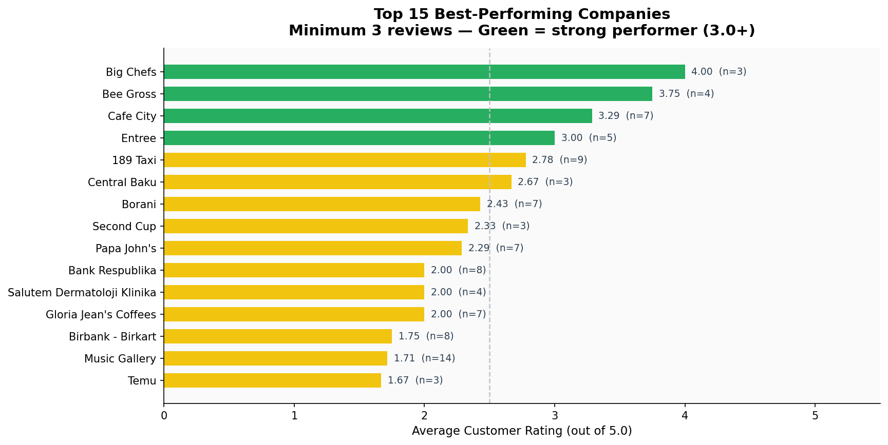

A small set of companies demonstrates that excellent ratings are possible — even in Azerbaijan's challenging consumer sentiment environment:

- **Big Chefs** — 4.0 average (3 reviews)
- **Bee Gross** — 3.75 average (4 reviews)
- **Cafe City** — 3.3 average (7 reviews)
- **189 Taxi** — 2.78 average (9 reviews)
- **Entree** — 3.0 average (5 reviews)

These companies serve as proof-of-concept that customer satisfaction is achievable. Their operational approaches — in hospitality, food service, and even taxi — should be studied by underperforming peers.

**What this means:** The market problem is not insurmountable. These outliers demonstrate that with the right product, service standards, and customer interaction model, brands can differentiate themselves even on a platform dominated by complaints.

---

## Finding 10 — Photo Evidence is Highest for Positive Reviews, Not Complaints

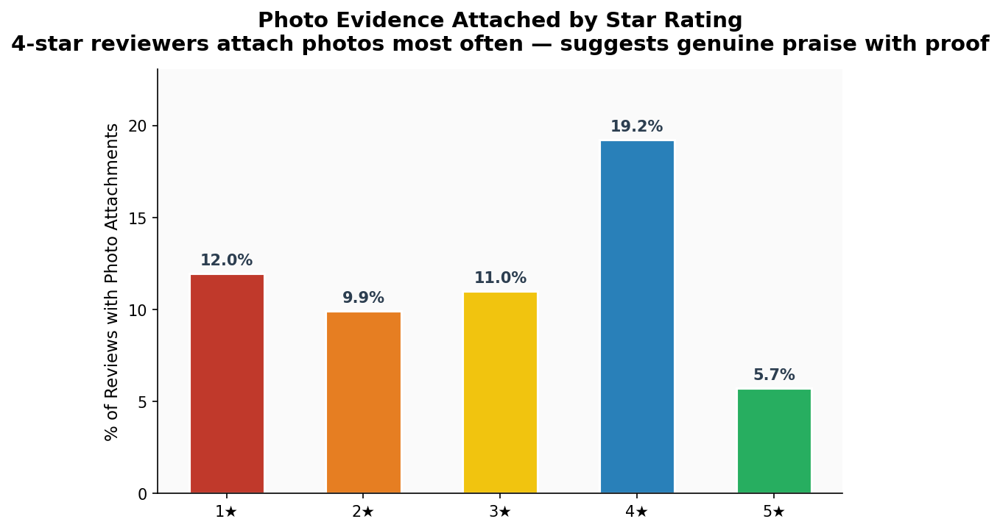

Contrary to the assumption that angry customers attach photos to prove their complaints, **4-star reviewers attach photos most frequently (19.2%)**, while 1-star and 5-star reviewers attach images the least.

**What this means:** Satisfied-but-critical customers (those giving 4 stars) are the most engaged and evidence-driven reviewers. These are precisely the customers who can become brand advocates if their minor concerns are addressed. Brands should identify and respond to 4-star reviewers as a priority — they are close to full satisfaction and provide the richest constructive feedback.

---

## Finding 11 — Review Activity Shows Concentration in Certain Periods

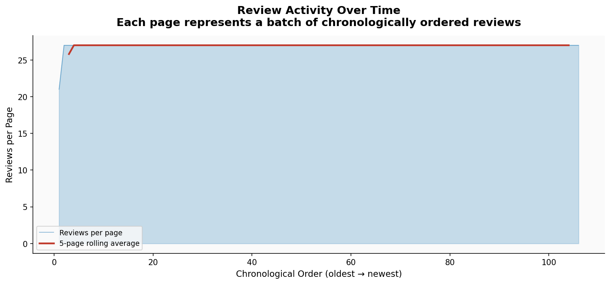

The review stream (from oldest to most recent) shows varying density across time, with notable spikes that likely correspond to major service disruptions, promotional campaigns, or viral social media moments. The most recent period (right side of the chart) shows sustained review activity, suggesting growing platform adoption.

**What this means:** Review spikes are business events, not random noise. Brands should monitor real-time review flows as an early warning system for service crises. A sudden surge in 1-star reviews on a single day almost always reflects a specific operational failure that requires immediate internal investigation.

---

## Finding 12 — Category Leaders Concentrate Public Attention

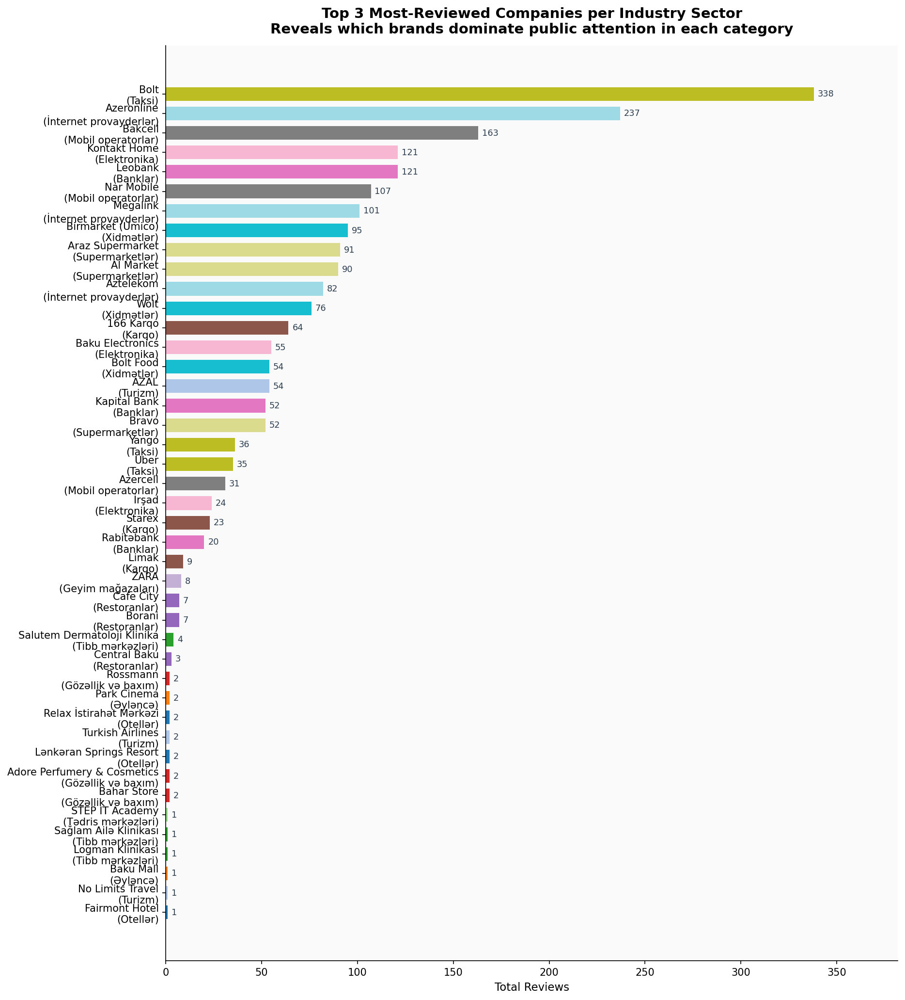

Within every sector, the top 1-3 brands receive the vast majority of reviews, while smaller competitors operate in relative obscurity. In Internet Providers, Azeronline alone accounts for 237 of 645 total sector reviews (37%). In Taxi, Bolt represents 81% of all taxi reviews.

**What this means:** Category leadership in Azerbaijan means being the primary target of both praise and criticism. Dominant brands have the greatest platform to shape sector reputation — and the greatest vulnerability when service quality slips. Challenger brands, by contrast, face a unique opportunity: if they can accumulate even a modest volume of positive reviews, the contrast with dominant-brand complaints becomes a powerful differentiator.

---

## Strategic Recommendations

### For Brand Owners & Operators
1. **If your 1-star rate exceeds 85%** — treat this as a business emergency. Do not invest in marketing until service operations are fixed.
2. **If you have zero reviews** — launch a structured initiative to invite satisfied customers to share their experience. First-mover advantage on positive reviews is significant.
3. **Monitor 4-star reviewers closely** — they are your most valuable feedback source and your most reachable advocates.
4. **Track review spikes in real time** — they signal operational events that need immediate internal response, not just a PR statement.

### For Industry Regulators & Consumer Bodies
1. Internet Providers, Mobile Operators, Taxi, and Banks are generating the most consumer complaints at scale. These sectors warrant structured consumer protection monitoring.
2. The 86.6% 1-star rate is a market-wide signal of unmet consumer expectations — not isolated company failures.

### For Investors & Market Analysts
1. A high review count on beledci.az is a **risk indicator**, not a sign of popularity.
2. Companies like Big Chefs, Bee Gross, and 189 Taxi — small by review volume but high by rating — represent the market's underserved quality segment with significant growth potential.
3. The Hotel and Restaurant sectors, while currently low in review volume, are the fastest to be disrupted by negative online sentiment as digital adoption accelerates.

---

## Data Reference

| Dataset | Records | Coverage |
|---|---|---|
| `data/companies.csv` | 139 companies | 16 industry categories |
| `data/feedbacks.csv` | 2,856 reviews | Pages 1–106 (full platform) |

Charts generated by `scripts/generate_charts.py` · Data collected by `scripts/companies.py` and `scripts/feedback.py`
